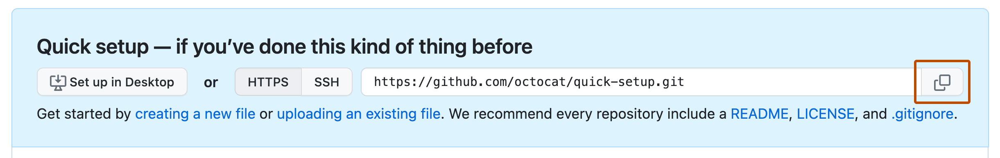
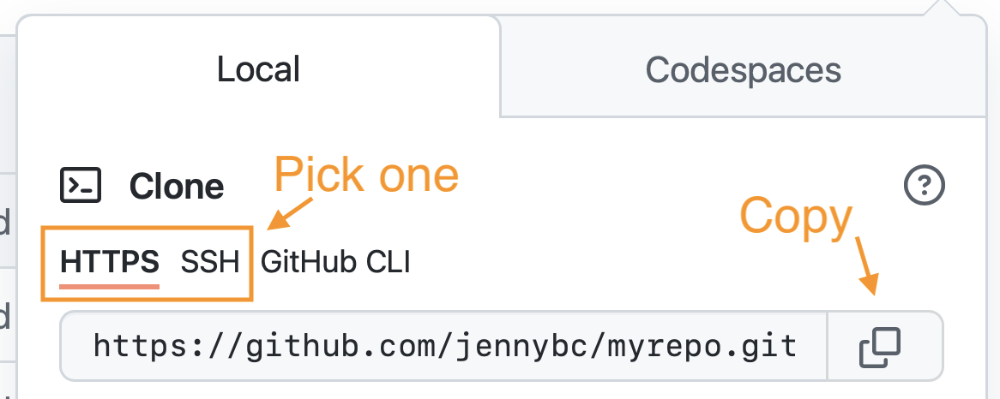
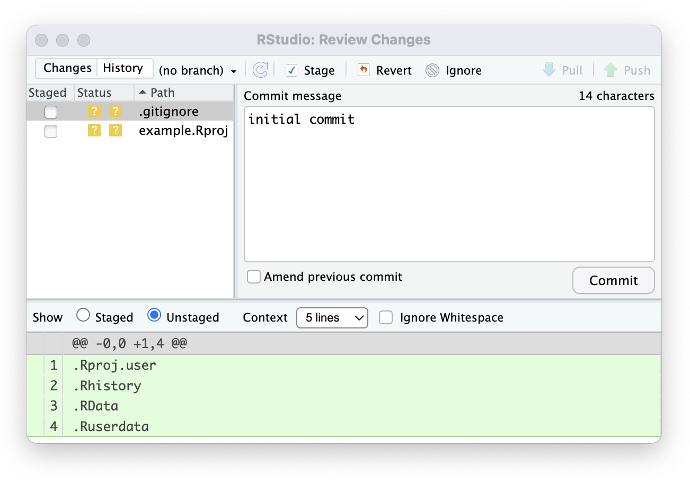
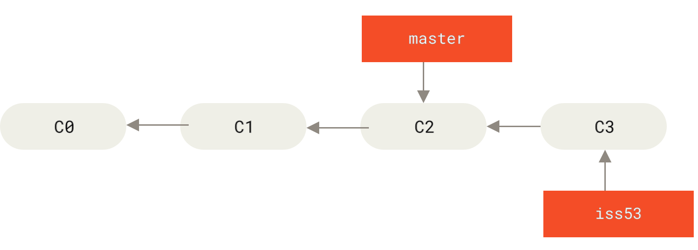

# Week 4 workshop: RStudio with Git and GitHub

Use this guide for setup and troubleshooting. Once connected, open **Week4_RStudio_Git_Lab.R** and stay in its numbered sections for demonstrations and practice. Tuesday uses sections 0–7. Thursday uses sections 8–14. Section 15 contains commented solutions. Use RStudio’s Git pane for everyday work, its built-in Terminal for the commands labeled Terminal, and GitHub in a browser for repository creation and Fork.

## 0. Before class

| Piece | Purpose | Check |
|---|---|---|
| RStudio Project | Opens the project folder and its R context | Project name appears at top right |
| Git | Records local file history | RStudio finds a Git executable |
| GitHub repository | Holds a connected online copy | You can open your own repository |
| Identity and authentication | Name commits and authorize online access | A test commit and Push succeed |

### 0A. Install Git and let RStudio find it

Git and RStudio are separate installations. In RStudio, choose **Tools > Terminal > New Terminal**, or open the **Terminal** tab beside Console. Type this there and press Enter:

```text
git --version
```

A version number means Git is available. If it is missing:

- **Windows:** install [Git for Windows](https://gitforwindows.org/). Keep the option that makes Git available to the command line and third-party software. Restart RStudio afterward.
- **macOS:** the version check may offer to install Apple's command line tools. Complete that installation. If no prompt appears, run `xcode-select --install` in RStudio's Terminal and follow the installer. Restart RStudio afterward.

In **Tools > Global Options > Git/SVN**, enable the version-control interface and confirm a Git executable appears. Some macOS versions put preferences in the RStudio menu. If needed, use Browse to select your installed Git executable. The screenshot shows an example path; your path can differ.


*Source: Posit RStudio User Guide. Documentation example.*

**Console versus Terminal:** `library(...)` and `usethis::...` are R expressions for the **Console**. Lines beginning with `git` are commands for the **Terminal**. Do not use the R editor's Run button for Terminal commands. The Git pane appears once the open project actually uses Git.

Have `readr`, `dplyr`, and `ggplot2` installed using **Packages > Install**, as in previous labs.

### 0B. Configure and check your local Git identity

Git records an author name and email with each commit. Replace the example values below, then enter one command at a time in **RStudio's Terminal**:

```text
git config --global user.name "Your Name"
git config --global user.email "you@example.com"
git config --global init.defaultBranch main
```

Use your own name and a verified GitHub email, or the exact no-reply address from **GitHub > Settings > Emails**. `--global` means the default for your computer's repositories. It does not configure GitHub or sign you in. `init.defaultBranch` applies to repositories you create later; it does not rename an existing branch.

Check the values explicitly:

```text
git config --get user.name
git config --get user.email
git config --get init.defaultBranch
```

These report the effective settings in the current folder. A repository-specific setting can override a global setting. If a value differs from what you set, ask for help inspecting the local configuration.

**R Console alternative:** install `usethis` using **Packages > Install**, then run these R expressions with your own details. Choose this or the Terminal configuration above; both configure the same Git installation.

```r
usethis::use_git_config(
  user.name = "Your Name",
  user.email = "you@example.com"
)
usethis::git_default_branch_configure(name = "main")
```

The setup commands are also collected in `Week4_Git_Terminal.txt`. The main R script contains setup prompts and checks; sourcing it never changes Git configuration.

### One-time GitHub authentication

Create your repository or fork using section 1 before authorizing access to it. If a credential manager opens browser sign-in during Clone or Push, complete that sign-in. An ordinary GitHub account password does not authenticate HTTPS Git operations.

If RStudio instead asks for credentials and no working credential manager is available, the instructor can help with a personal access token:

1. On GitHub, open **Settings > Developer settings > Personal access tokens > Fine-grained tokens > Generate new token**.
2. Choose an expiration, your account as resource owner, and **Only select repositories**, selecting your practice repository. For the website exercise, also select your own website fork, or update the token’s selected repositories later.
3. Give that repository **Contents: Read and write** access. This exercise edits ordinary files and does not need workflow permissions.
4. Install `gitcreds` through **Packages > Install**. In the R Console, run `gitcreds::gitcreds_set()` and enter the token only at its interactive credential prompt. Keep it out of scripts, README files, screenshots, and notes. If credentials already exist, read the prompt deliberately rather than replacing another account accidentally.
5. Retry the operation. If it fails, check the account, repository access, token expiration, and any approval requirement.

After this one-time setup, use the Git pane for Commit, Pull, and Push. Retain any existing working institutional sign-in method.

### Concepts behind the buttons

Version control records file changes so we can compare and recover recorded versions. Pro Git’s snapshot diagram shows the state recorded at each commit. Unchanged files reuse stored content. In this lab, changing the R script can leave the data file unchanged.


*Chacon and Straub, Pro Git, 2nd edition, §1.3, Figure 5. CC BY-NC-SA 3.0. Original diagram.*


*Pro Git, §1.3, Figure 6. CC BY-NC-SA 3.0. Original labels retained. In RStudio: Save changes the working file; Staged selects a version; Commit records it in local history. The hidden .git directory stores that history. Checkout means putting a recorded version into the working files, as when switching branches.*

## 1. A project folder, a Git repository, and a GitHub copy

A **repository** stores project files and the history Git records through commits. The hidden `.git` directory stores local history and settings. An `.Rproj` file stores RStudio project settings. Creating an `.Rproj` alone does not initialize Git.

For the R analysis, choose **Path A or Path B**, not both for the same project. Path C is a separate exercise using the course website template.

| Starting point | Route | Result |
|---|---|---|
| Files already on your computer | A. Initialize the folder, commit, then connect an empty GitHub repository | Existing local work gains version control and an online copy |
| You want a fresh online practice repository | B. Create GitHub repository with README, then clone it | RStudio receives its files, history, and remote connection |
| Someone else's repository is your starting point | C. Fork on GitHub, then clone your fork | Your own online copy plus a local RStudio project |

### 1A. Turn an existing folder into a Git repository and push it

**Predict:** after Git initialization, what will exist locally? What will still be absent on GitHub?

1. Copy the contents of `starter-project`, including `.gitignore`, into a new folder named **css-rstudio-practice**. Keep it outside the downloaded teaching folder and outside any existing repository. A local folder outside Box, OneDrive, or iCloud avoids synchronization conflicts. For an existing project of your own, use its project folder instead.
2. In RStudio, choose **File > New Project > Existing Directory**, select that folder, and click **Create Project**. If it already has an `.Rproj`, open that file.
3. Choose **Tools > Project Options > Git/SVN**. Select **Git** as the version control system, confirm initialization, and allow RStudio to restart the project. This creates `.git` without moving your project files. If the folder already uses Git, skip initialization.
4. Open `Week4_RStudio_Git_Lab.R`, run sections 1–2, and check the baseline plot. Review `.gitignore`. In the **Git pane**, inspect the starter files, tick **Staged**, click **Commit**, and record **Add baseline R analysis**. Include the `.Rproj`, `.R` script, README, `.gitignore`, data, and practice files. This first commit creates local history.
5. On GitHub, create a new **Private** repository named **css-rstudio-practice** under your account. Leave **README**, **.gitignore**, and **license** unselected. The repository must be **empty**, because the local folder already has its first commit. Copy the HTTPS URL from **Quick setup**.



*Source: GitHub Docs. Example URL; copy your own repository address.*

6. Return to this project's RStudio window and open **Tools > Terminal > New Terminal**. Check where you are before connecting anything:

```text
pwd
git rev-parse --show-toplevel
git status
git branch --show-current
git remote -v
```

The first two commands should identify the practice project folder. If `pwd` is not recognized in Windows Command Prompt, enter `cd` with no arguments to display the current folder. `git status` should show your committed baseline with no pending changes. A new local repository has no remote URL yet. If it names a different project or an existing remote, stop and inspect that setup instead of initializing or replacing it.

7. If this newly created practice repository uses `master` instead of `main`, rename it with `git branch -m main`. Skip that command when it already says `main`. Then, in **Terminal**, replace `YOUR-USERNAME` in the full URL below and run:

```text
git remote add origin https://github.com/YOUR-USERNAME/css-rstudio-practice.git
git remote -v
```

`origin` is a local nickname for the remote URL. Adding it does not upload any files. Check that both displayed URLs belong to **your** GitHub repository before the next command.

```text
git push -u origin main
```

This uploads your existing commits and sets local `main` to track `origin/main`. Finish sign-in if prompted, using section 0's authentication instructions. Refresh the GitHub page and check the files, branch, and **Add baseline R analysis** commit. You can now use RStudio's **Push** and **Pull** buttons for ordinary updates.

**Path A check:** Git History shows the baseline locally; GitHub shows the same commit and source files. Initialization, commit, adding a remote, and push are four different actions. Continue to section 2 without creating a second baseline commit.

**Alternative initialization:** if the Project Options menu differs, use `git init -b main` in this folder's RStudio Terminal (Git 2.28 or newer), then reopen its `.Rproj`. Another option is `usethis::use_git()` in the **R Console**. Choose one initialization method, then continue with the Git pane's first commit.

### 1B. Alternative: create on GitHub, then clone in RStudio

This path starts with a repository that already has a README commit on GitHub. Use it instead of Path A for the analysis project.

1. In a browser, sign into GitHub and create `css-rstudio-practice`. Select **Private** and **Add a README file**. Leave the license and Git ignore template unset for now; the starter includes `.gitignore`.
2. Open **Code > HTTPS** and copy the repository URL.



*Happy Git documentation example. Copy your own address, not the one pictured.*

3. In RStudio, select **File > New Project > Version Control > Git**.
4. Paste the URL into **Repository URL**. Choose a local parent folder outside the course download and any existing repository. Prefer a local working folder rather than a folder actively synchronized by Box, OneDrive, or iCloud. Let RStudio create the project directory.
5. Click **Create Project**. Find README, the generated `.Rproj`, the **Git** tab, and branch `main`. If you customized your GitHub default branch, use that name consistently wherever this guide says `main`.
6. Use Finder or File Explorer to copy the **contents** of the downloaded `starter-project` into the clone. Replace the initial README with the supplied project README. Include `.gitignore` and `data`. Keep the clone-generated `.Rproj`; do not copy another `.Rproj` or a `.git` directory from the teaching folder. On macOS, Command-Shift-period shows hidden files. Alternatively, create `.gitignore` in RStudio’s text editor using the supplied contents.
7. Open `Week4_RStudio_Git_Lab.R` from this connected folder.

**Path B check:** script, README, `.Rproj`, and `data` sit together in the clone. Git lists the new files and the branch is `main`. Cloning has configured a remote named `origin`: the connection to your GitHub repository.

A clone includes history and a remote connection. A ZIP contains files without Git history. An `.Rproj` establishes RStudio’s working folder; it does not by itself add Git.

### 1C. Fork the course website, then clone your fork

A **fork** is a repository under your GitHub account that begins from someone else's repository. A **clone** brings one remote repository's files and history onto your computer. Forking alone does not put files in RStudio. Downloading a ZIP does not supply Git history or a remote connection.

1. In a browser, open [the course website template](https://github.com/ShuyuanShen/quarto-academic-website-template). Click **Fork**, choose your account as **Owner**, and click **Create fork**. Keep the repository name. If you already have this fork, open it instead of creating another.


*Source: GitHub Docs. The screenshot is a documentation example.*

2. On **your fork**, click **Code > HTTPS**, then copy the URL. The repository owner in the URL should be your username. In RStudio choose **File > New Project > Version Control > Git**, paste that URL, choose a parent folder outside the analysis project, and click **Create Project**. Keep the template's existing `.Rproj` file.
3. In this website project's **Terminal**, run `git remote -v` and `git status`. `origin` should point to your own fork. Git history already exists, so no `git init` or `git remote add origin` is needed.
4. For a small connection check, open **README.md** in RStudio and replace its first heading with **Your Name's website: start here**. Save, inspect **Diff**, stage that file, Commit with **Personalize website README**, and **Push**. Refresh your fork on GitHub and verify the changed heading and commit. This README edit requires no Quarto rendering.
5. Explain where your Push went. It updates your fork; it does not change the instructor's repository. Forking a website repository also does not publish a live website. The template README explains page editing, rendering, and GitHub Pages for later work.
6. Reopen your **css-rstudio-practice .Rproj** before continuing the visualization lab. The website project and analysis project are separate repositories.

For a repository you already own or can access, you can clone it directly without a fork. A public repository may allow cloning while still denying Push to someone else's account.

**Terminal alternative to RStudio's clone dialog:** open a Terminal in the chosen **parent** folder, replace `YOUR-FORK-URL` with your fork's full HTTPS URL, and run `git clone YOUR-FORK-URL`. Then open the `.Rproj` inside the newly created folder. If a different repository has no `.Rproj`, use **File > New Project > Existing Directory** there. Do not run both clone methods into the same folder.

**Scope of this exercise:** keep local `main` tracking `origin/main`, your own website fork. Happy Git's advanced contribution workflow also discusses an `upstream` remote and a different tracking arrangement; we do not need those extra steps to personalize this template.

## 2. Baseline analysis and the Git pane

Run script sections 1–2. The baseline selects 2007, gives 142 country observations and five continent groups, and plots GDP per capita against life expectancy.


*Posit documentation example. Its filenames and “no branch” state differ from our connected main branch. Pane placement and icons may vary by version.*

If Path A already created and pushed **Add baseline R analysis**, verify it in History and on GitHub, then continue to section 3. Otherwise, save. In **Git**, inspect the starter files, then tick **Staged** for the script, `.Rproj`, README, `.gitignore`, data, and practice fixtures. Click **Commit**, enter `Add baseline R analysis`, and commit. **Push** and refresh GitHub to verify the files arrived. This is the baseline checkpoint.

## 3. Save, diff, stage, commit

Follow script section 3: change `analysis_year` from 2007 to 1997 and rerun sections 1–2. Save, select the file in Git, and click **Diff**.



*Posit example. Our file is Week4_RStudio_Git_Lab.R and our message is Compare life expectancy in 1997.*

- **Save** writes edits to the local file.
- **Diff** displays additions and removals relative to another version.
- **Staged** selects saved changes for the next commit.
- **Commit** records the staged snapshot and message in local history.
- **Push** sends local commits to the remote branch.

Read the diff, tick Staged, inspect the staged change, enter the message, and Commit. Leave **Amend previous commit** unchecked. If you edit after staging, inspect and stage that newer edit too.

**Check:** the diff records one year change. Rerunning checks the analytical effect. An empty Git pane does not prove correctness or successful sharing.

## 4. History

Use Git’s **History** clock icon, the Git menu’s History option, or History in Review Changes. Select a commit and file to see the recorded change. The message explains its purpose; the diff shows its content. The main RStudio **History** pane lists R expressions, while **Git History** lists commits. Use Git History here.

## 5. Push and pull


*Posit example. Down arrow: Pull. Up arrow: Push. The example predates its first commit, so some controls are disabled. Our clone has a branch and remote.*

Push from RStudio, then verify the correct branch, message, and source on GitHub. Add the connection-check line to README in GitHub’s browser editor and commit directly to `main`. With a clean Git pane locally, **Pull** and inspect README. Script section 5 gives the exact text.

Push sends commits to the remote. Pull retrieves remote changes and integrates them into the current local branch. This is deliberate synchronization, not continuous background sharing.

## 6. Ignored files

Run section 6 to save the plot. It appears in **Files** under `outputs/` and stays absent from **Git** because `.gitignore` excludes that directory. Track the script and input so a collaborator can recreate it. Track `.gitignore` itself.

Session files such as `.Rproj.user/`, `.Rhistory`, and `.RData` stay local. Keep the `.Rproj` settings file in Git. Ignore rules do not remove already tracked files or erase earlier commits.

## 7. Tuesday handoff

Complete G07: update README to describe the current 1997 analysis and one interpretation detail. Save, Diff, Stage, Commit, Push, and verify online. Commit practice notes separately. End on clean `main`.

## 8. Thursday starting point

Reopen the same connected `.Rproj`. Finish pending edits, confirm `main`, and Pull. Rerun sections 1–2 and 6. Verify 1997 and 142 rows. The saved script is authoritative; the Environment may still contain objects from before a branch switch or Pull.

## 9. A branch in RStudio

A branch is a line of development in a repository. It lets a proposal accumulate commits before joining accepted work on `main`.

1. On clean, current `main`, click **New Branch** beside Git’s branch selector.
2. Name it `clarify-labels`. Select remote **origin** if asked. Create and confirm the branch name.
3. Make the two label edits in script section 9. Rerun, save, inspect Diff, stage, commit `Clarify plot units`, and Push.
4. With no pending edits, use the branch dropdown to inspect `main`, then return to `clarify-labels`. Rerun after switching. Both branches use the same project folder.

**If branch controls differ:** create `clarify-labels` from `main` using GitHub’s branch dropdown. In RStudio on clean `main`, Pull to refresh remote branches. Select `origin/clarify-labels` in the branch dropdown and accept creation of a local tracking branch if prompted. If absent, reopen the project and ask the instructor to check the connection.

**Check:** labels change; year and country count do not. The proposal branch appears on GitHub after Push.



*Pro Git, §3.2, Figure 20. CC BY-NC-SA 3.0. Original labels: master is analogous to our main, iss53 to clarify-labels, and C3 to our label-change commit. Arrows from commits point toward their parent history.*

## 10. Pull request and review

A **pull request** proposes bringing one branch’s changes into another and provides a review space. **Pull** updates your local branch from a remote.

1. After Push, click **Compare & pull request** on GitHub, or **Pull requests > New pull request**.
2. Confirm **base: main** and **compare: clarify-labels**. Use the title and explanation in script section 10, then create the request.
3. Open **Files changed** with a partner. Check units, intended scope, and the successful R rerun.
4. Revise in RStudio on `clarify-labels` if needed. Save, review, stage, commit, and Push. The existing request updates.


*GitHub documentation examples. Our proposed branch is clarify-labels.*

A partner can review a private solo repository on the owner’s screen and give verbal feedback. Record it in the PR description. Authors cannot approve their own requests. Separate-account reviews or edits require access granted by the owner. Do not share logins.

A **fork** is a separate repository on GitHub, often used when you cannot contribute directly to an original. The website exercise in section 1C uses a fork. The analysis pull request here stays within your practice repository.

## 11. Merge, pull, rerun

After review, the owner clicks **Merge pull request** and confirms. In RStudio, verify no unfinished edits, select local `main`, and Pull. Rerun and inspect. Both axes now state units, the year remains 1997, and there are 142 countries.

Browser Merge changes online `main`. Pull updates local `main`. Running R recreates its objects and plot. Check all three. A successful merge does not establish analytical correctness.

## 12. Conflict interpretation

Use `conflict-practice.txt`. It contains **typed example markers**, not a real unresolved Git merge. Do not run it as R. Choose the intended year and replace the whole marker block with the correct assignment. Follow script section 12.

If a real Pull conflict occurs, Git identifies an unresolved file. Open it in RStudio, agree on the intended analysis, remove markers and unwanted text, save, stage the resolved file, and finish the merge commit. Rerun and inspect before Push. Ask for help when the state is unclear. The simulation practices a content decision; it does not demonstrate completion of a real merge.

## 13. Recovery

Use the harmless README exercise in the script. RStudio’s **Revert** for selected changes discards uncommitted edits. Inspect the diff and confirmation carefully; uncommitted text has no Git checkpoint.

For the committed typo, inspect History, edit the correct text, and make a new correction commit. Both mistake and repair stay visible. This workflow uses ordinary edits and commits.

## 14. Handoff

A partner should find the question, source, year, script, and run instructions, then explain and rerun the plot. Write one next task with a concrete success check. Push and verify final notes on `main`. No additional file upload is required.

## Troubleshooting and offline work

| Symptom | Check and next step |
|---|---|
| No Git tab | Open the connected `.Rproj`; confirm Git detection in Git/SVN preferences. Reopen your practice project. Use section 1A to initialize only an intended local project folder; use section 1C to clone an existing fork. |
| CSV missing | Open the clone’s `.Rproj`; data/gapminder.csv belongs directly under that folder. |
| Nothing to commit | Save first; check whether the change is already committed or ignored. |
| Commit needs identity | Complete section 0’s one-time identity setup. |
| Push disabled | A local-only project needs a first commit, an origin URL, and the first `git push -u origin main` from section 1A. A clone already has origin. |
| `remote origin already exists` | Inspect `git remote -v`. If it is already the correct repository, skip adding it. Ask for help before changing a different connection. |
| `src refspec main does not match any` | Check that a first commit exists and inspect the actual branch name. Do not force Push. |
| New local project cannot push to a nonempty GitHub repo | Path A needs an empty remote. Use a new empty repository or ask for help reconciling histories; do not force Push. |
| Authentication fails | Check account, token expiration, repository permission, and setup. An account password alone is insufficient for HTTPS Git. |
| Push rejected because online work is newer | Finish/commit local edits, Pull, inspect and rerun, then Push. Stop for help if a conflict appears. |
| Branch switch blocked | Save and commit meaningful work, or deliberately discard only an unwanted edit. Switch from a clean state. |
| Plot still old after Pull | Verify saved source and branch, then rerun sections 1–2 and 6. Environment objects do not update automatically. |
| Internet unavailable | Continue local analysis, commits, History, and branch practice. Review on screen. Mark online steps unfinished and complete them after access returns. |

For a fully offline start, copy starter-project to a new local folder. Use **File > New Project > Existing Directory**, then **Tools > Project Options > Git/SVN**, select Git, confirm initialization, and restart. Make a local baseline commit. This is local practice without a remote. When online again, keep this same folder and follow section 1A from creating an empty GitHub repository through the first Push. Local comparison does not complete a GitHub pull request.

## Sources and screenshot credits

The course examples adapt these workflows. Documentation screenshots retain their source filenames and labels. Accessed September 21, 2026.

- [Posit: version control](https://docs.posit.co/ide/user/ide/guide/tools/version-control.html): [overview](https://docs.posit.co/ide/user/ide/guide/tools/images/rstudio-vcs-pane-labeled.png), [Git pane](https://docs.posit.co/ide/user/ide/guide/tools/images/git-tab.png), [Review Changes](https://docs.posit.co/ide/user/ide/guide/tools/images/git-commit-pane.png).
- [Posit: RStudio Projects](https://docs.posit.co/ide/user/ide/guide/code/projects.html).
- [Happy Git: GitHub first](https://happygitwithr.com/new-github-first), [HTTPS screenshot](https://happygitwithr.com/img/github-https-or-ssh-url-annotated.png), [identity](https://happygitwithr.com/hello-git), [credentials](https://happygitwithr.com/https-pat), [branches](https://happygitwithr.com/git-branches).
- [GitHub: personal access tokens](https://docs.github.com/en/authentication/keeping-your-account-and-data-secure/managing-your-personal-access-tokens).
- [GitHub: creating a pull request](https://docs.github.com/en/pull-requests/how-tos/create-pull-requests/creating-a-pull-request), [reviewing changes](https://docs.github.com/en/pull-requests/how-tos/review-pull-requests/reviewing-proposed-changes-in-a-pull-request). The banner and Files changed screenshots come from these pages.
- [Git: repositories](https://git-scm.com/book/en/v2/Git-Basics-Getting-a-Git-Repository), [recording changes](https://git-scm.com/book/en/v2/Git-Basics-Recording-Changes-to-the-Repository), [ignore rules](https://git-scm.com/docs/gitignore).
- [GitHub: conflicts](https://docs.github.com/en/pull-requests/reference/merge-conflicts), [forks](https://docs.github.com/en/get-started/quickstart/fork-a-repo).
- [Gapminder teaching extract](https://github.com/jennybc/gapminder), copied unchanged from Week 3.
- Assigned [Git & GitHub Crash Course](https://www.youtube.com/watch?v=mAFoROnOfHs). Huddles retrieve viewing notes; classroom practice uses RStudio.

- Chacon and Straub, [Pro Git §1.1: version control](https://git-scm.com/book/en/v2/Getting-Started-About-Version-Control), [§1.3: What is Git?](https://git-scm.com/book/ms/v2/Getting-Started-What-is-Git%3F), and [§3.2: branching](https://git-scm.com/book/en/v2/Git-Branching-Basic-Branching-and-Merging). Diagrams reproduced from the [official book source](https://github.com/progit/progit2/tree/main/images) under [CC BY-NC-SA 3.0](https://creativecommons.org/licenses/by-nc-sa/3.0/).

### Additional setup references

- [R for the Rest of Us: How to Use Git/GitHub with R](https://rfortherestofus.com/2021/02/how-to-use-git-github-with-r), David Keyes, February 2021. Useful overview of RStudio and `usethis`; use current GitHub documentation for token permissions.
- [Happy Git: install Git](https://happygitwithr.com/install-git), [introduce yourself to Git](https://happygitwithr.com/hello-git), [existing project, GitHub last](https://happygitwithr.com/existing-github-last), and [fork and clone](https://happygitwithr.com/fork-and-clone).
- [GitHub: adding local code](https://docs.github.com/en/migrations/importing-source-code/using-the-command-line-to-import-source-code/adding-locally-hosted-code-to-github) and [forking a repository](https://docs.github.com/en/pull-requests/how-tos/work-with-forks/fork-a-repo).
- Screenshots: [RStudio Git/SVN settings](https://docs.posit.co/ide/user/ide/guide/tools/images/version-control-options.png), [empty repository URL](https://docs.github.com/assets/cb-48146/images/help/repository/copy-remote-repository-url-quick-setup.png), and [Fork button](https://docs.github.com/assets/cb-34352/images/help/repository/fork-button.png). Accessed September 21, 2026.
